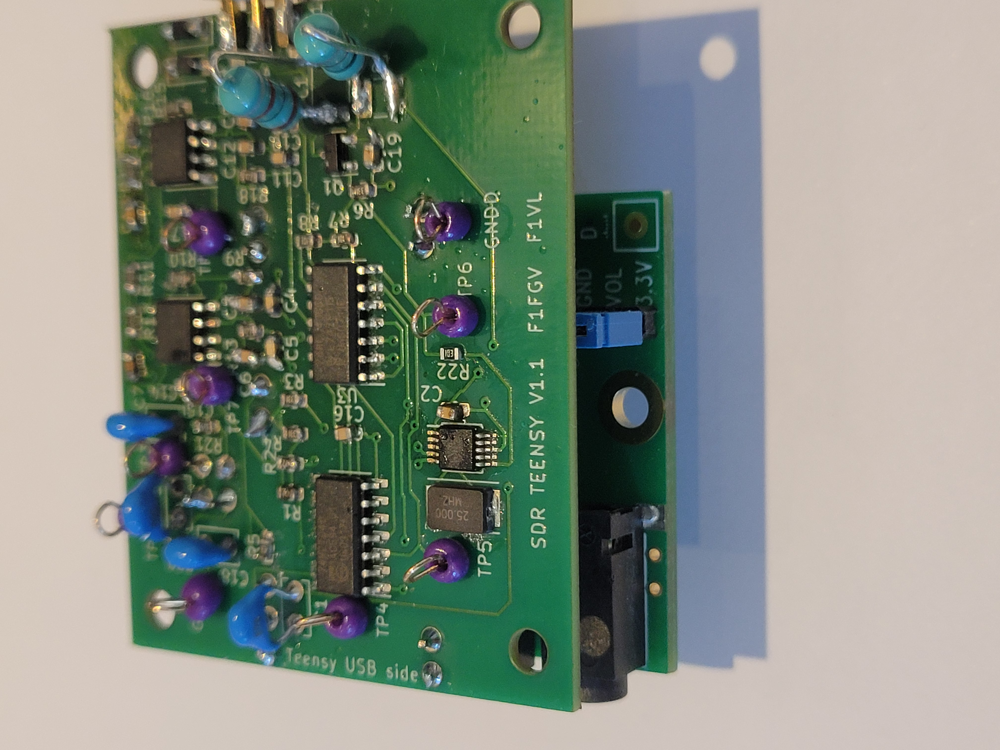
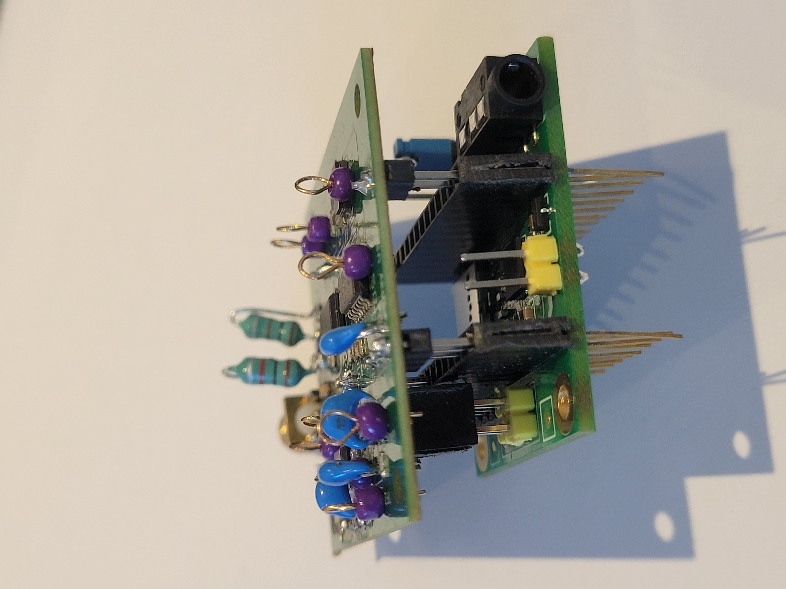
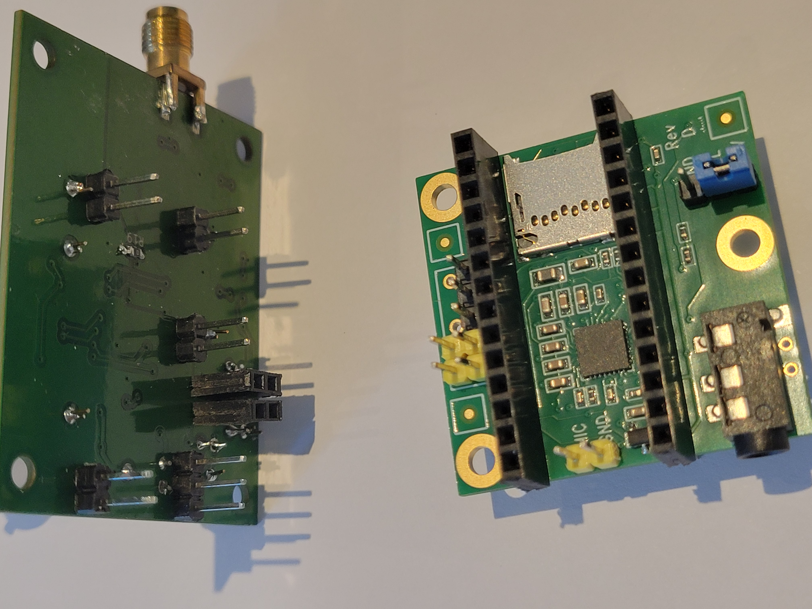
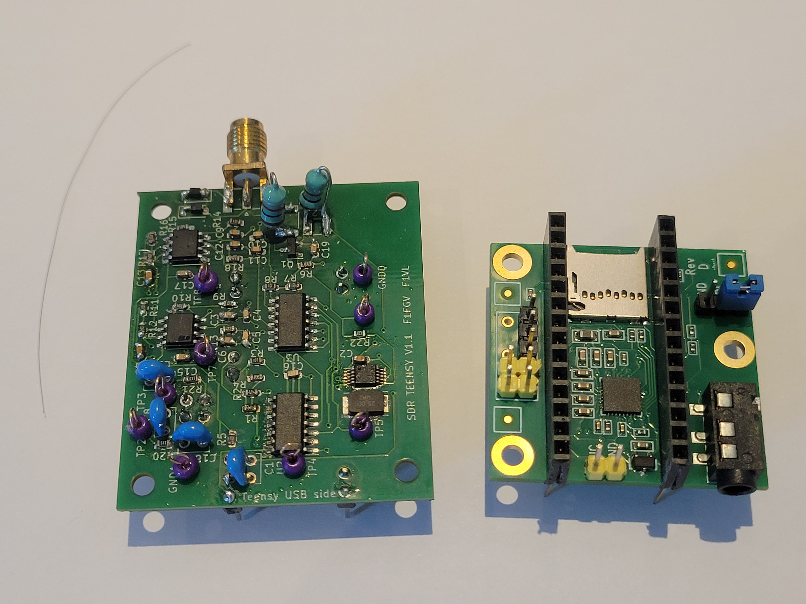
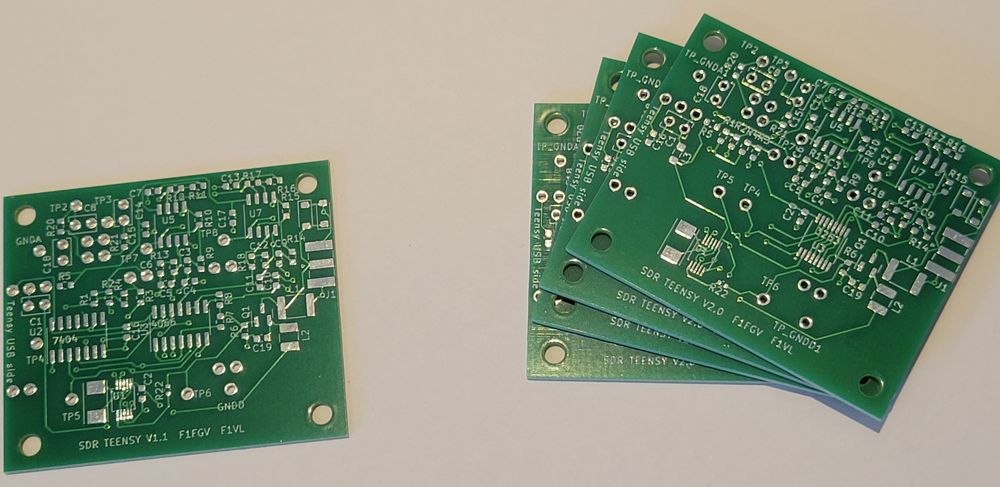

### SDR front end for teensy and teensy audio

This frontend board stacks on top of a teensyaudio board which iself is stacked on the teensy.

  <table style="width:100%">
    <tr>
      <td></td>
      <td></td>
      <td></td>
      <td></td>
    </tr>
  </table>

Teensy 4.0 is used, schematic is heavily inspired by the Elektor board: https://www.elektormagazine.fr/labs/software-defined-radio-sdr-shield-for-arduino-150515-1

The differences are:

The frequency is not divided by 4 to make quadrature signals (no 7474 flipflops), rather the quadrature will have to be generated by the si5351.
A provision for an external oscillator input is made (V1.0 only), it uses a separate SMA

PCB layout attempts to minimize noise with separate ground planes for digital and analog

Versions (V2.0 is in its own branch):

</td>

V 1.1 fixes a cabling error to two of the 6022 op-amps, removes the external oscillator input, internally connects the 3rd output of the si5351 frequency synthetiser to the input allowing fot tests and calibration of the signal path

V 1.1 uses a 74HC4066 multiplexer and is good to 30MHz, has a cabling error underneath where the zero ohm resistor connecting the 2 ground plane is not connected on one side.

V 2.0 uses a SN74CBTL3253 and should be good to 150MHz (work in progress, not tested yet)
